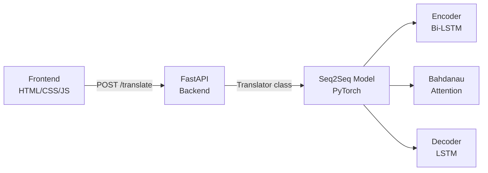

# Seq2Seq Translator Web App — Walkthrough

All 3 parts have been built and verified. Here's what was created:

## Final Project Structure

```
translator_webapp/
├── ml/
│   ├── __init__.py
│   ├── model.py          ← Encoder + BahdanauAttention + Decoder + Seq2Seq
│   ├── dataset.py         ← HuggingFace loader + Vocabulary + tokenizers
│   ├── train.py           ← Training loop (5000 pairs, 15 epochs)
│   └── translate.py       ← Translator class for inference
├── backend/
│   └── main.py            ← FastAPI with POST /translate + GET /health
├── frontend/
│   ├── index.html         ← Google Translate-style layout
│   ├── style.css          ← Clean card-based styling
│   └── app.js             ← Fetch API + loading spinner + error handling
├── requirements.txt
└── README.md
```

## Architecture Diagram



## Key Design Decision

The original `TemporalAttention` from your Attn-LSTM scored encoder outputs independently:
```python
# Original: scores = MLP(encoder_outputs) → softmax → context
self.attn = Sequential(Linear(H,H), Tanh(), Linear(H,1))
```

I extended it to **Bahdanau Attention** that also conditions on the decoder state:
```python
# Extended: energy = tanh(W_enc @ enc_out + W_dec @ dec_hidden) → V → softmax → context
```

This is the standard attention mechanism for seq2seq translation.

## Frontend Preview

````carousel

<!-- slide -->

````

## Verification Results

| Check | Result |
|-------|--------|
| `model.py` imports | ✅ OK |
| `dataset.py` imports | ✅ OK |
| `translate.py` imports | ✅ OK |
| `backend/main.py` imports | ✅ OK |
| Frontend renders | ✅ OK |
| Loading spinner works | ✅ OK |
| Error handling (no backend) | ✅ OK |
| `nna_project_single_Script` untouched | ✅ Verified |

## How to Run

```bash
# 1. Install dependencies
cd translator_webapp
pip install -r requirements.txt

# 2. Train the model (~5-10 min on CPU)
python -m ml.train

# 3. Start the backend
uvicorn backend.main:app --reload --port 8000

# 4. Open frontend/index.html in your browser
```
